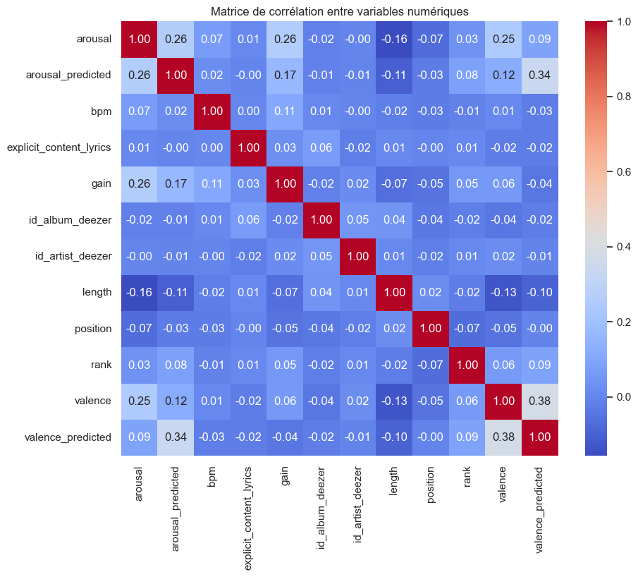
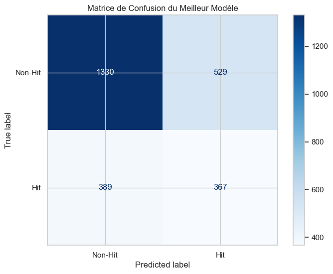
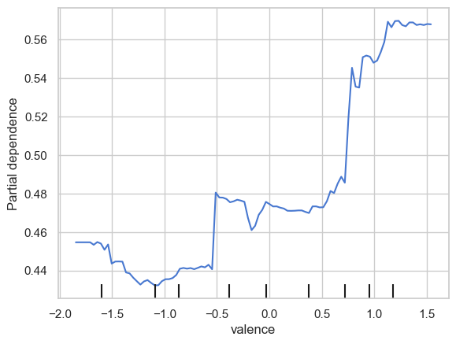

#  Project: The New Taylor Swift
### *Predicting Global Hits through Data Science & Machine Learning*

##  Overview
As junior Data Scientists for a major music label, our mission was to mathematically decode the "formula" behind global musical hits from the last few decades. Using the **Wasabi (ANR)** and **Billboard Hot 100** datasets, we explored whether success is a result of creative genius or identifiable patterns in audio features and metadata.

This project strictly follows the **CRISP-DM** methodology to ensure a rigorous and business-oriented analytical approach.

## Key Research Questions
1. **The Magic Formula:** Can we predict if a song will be a "Hit" based on audio features?
2. **Musical Cycles:** Are current pop trends just a revival of the 80s?
3. **The "Track 7" Myth:** Does a song's position in an album influence its success?
4. **The TikTok Effect:** How has social media changed song structures (chorus timing, duration)?

## Tech Stack & Methodology
* **Data Prep:** Cleaning massive datasets, feature engineering, and merging audio features with historical charts.
* **Machine Learning:** Implementation and comparison of **at least 3 models** per question (Random Forest, KNN, SVM, etc.) with hyperparameter tuning.
* **Tools:** Python (Pandas, NumPy, Scikit-learn, Matplotlib, Seaborn).

##  Results & Visualizations
Here are some key insights from our analysis:

### 1. Feature Correlation

### 2. Model Performance
The following table shows the results of our best model (Random Forest) for predicting song success:

| Class | Precision | Recall | F1-Score | Support |
| :--- | :---: | :---: | :---: | :---: |
| **0 (Non-Hit)** | 0.77 | 0.73 | 0.75 | 586 |
| **1 (Hit)** | 0.41 | 0.46 | 0.44 | 267 |
| **Accuracy** | | | **0.65** | 853 |
| **Macro Avg** | 0.59 | 0.60 | 0.59 | 853 |
| **Weighted Avg** | 0.66 | 0.65 | 0.66 | 853 |

The confusion matrix of our model:

Top 20 most important features: 

The impact of the emotional tone of the song on its probablity of becoming a hit:

### 3. Discussion
The following project proved that the technical elements of a song aren't alone enough to decide on if the will be a hit. Yes, dancibility and the emotional tone of the song play a role in the over all enjoyibility of a song, but other factors come into play: the label, the popularity of the artist, and the current social trends.

##  Repository Structure
* `The_new_taylor_swift.ipynb`: The main Jupyter Notebook with commented code and full pipeline.
* `Report_Final.pdf`: Detailed study justifying algorithm choices and business insights.
* `Slides.pdf`: Presentation used for the final defense.
* `data/`: Data source references and metadata.
* `assets/`: Images and graphs used in this README.

##  Academic Context
Project realized during the **IFIE 2** curriculum at **IMT Mines Albi** (2025-2026).

---
*Note: This repository is for educational and portfolio purposes.*
